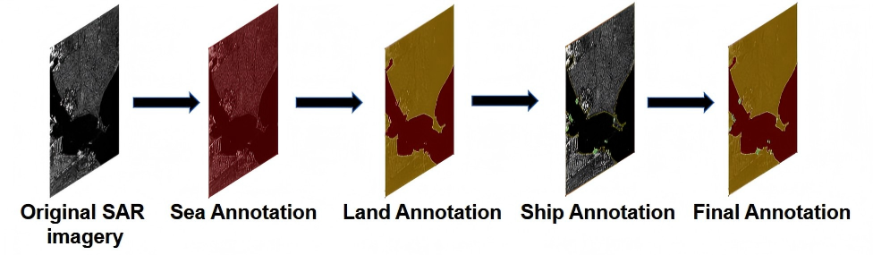

<div align="center">
<h1>PsSAR-v1.0-Unlocking-SAR-Panoptic-Segmentation</h1>

Liang Zhang, Ziyu Lin, Chenyue Liu, Sai Ma, Zizhuo Teng, Enling Wu, Xingyu Jiao, Jiayi Song, Lihan Wang, Pingling Fang, Xin Zhang* (*Corresponding author)

</div>


## Contents
- [Introduction](#introduction)
- [Install](#install)
- [Dataset](#dataset)
- [Train](#train)
- [Model Weights](#model-weights)
- [Inference](#local-inference)
- [Evaluation](#evaluation)

## Introduction
### Contributions
We propose the first public SAR panoptic segmentation dataset, named PsSAR-v1.0. Derived from HRSID, this dataset contains 5604 high resolution SAR images and their corresponding annotationsfor panoptic segmentation tasks. Based on PsSAR-v1.0, we constructs a bench-mark and conducts evaluations on SOTA panoptic segmentation models.

### PsSAR-v1.0 Performance
<table style="text-align: center; caption-side: top; margin:auto; border-collapse: collapse;">
  <thead>
    <tr>
      <th style="text-align:center; padding:8px; border:1px solid #ddd;">Benchmark Method</th>
      <th style="text-align:center; padding:8px; border:1px solid #ddd;">Backbone Network</th>
      <th style="text-align:center; padding:8px; border:1px solid #ddd;">Category</th>
      <th style="text-align:center; padding:8px; border:1px solid #ddd;">PQ(%)</th>
      <th style="text-align:center; padding:8px; border:1px solid #ddd;">SQ(%)</th>
      <th style="text-align:center; padding:8px; border:1px solid #ddd;">RQ(%)</th>
      <th style="text-align:center; padding:8px; border:1px solid #ddd;">Model Size</th>
      <th style="text-align:center; padding:8px; border:1px solid #ddd;">Latency</th>
    </tr>
  </thead>
  <tbody>
    <!-- Maskformer - ResNet-50 -->
    <tr align="center">
      <td style="padding:8px; border:1px solid #ddd; vertical-align:middle;" rowspan="3"><b>Maskformer</b></td>
      <td style="padding:8px; border:1px solid #ddd; vertical-align:middle;" rowspan="3">ResNet-50</td>
      <td style="padding:8px; border:1px solid #ddd;">Overall</td>
      <td style="padding:8px; border:1px solid #ddd;">63.96</td>
      <td style="padding:8px; border:1px solid #ddd;">86.368</td>
      <td style="padding:8px; border:1px solid #ddd;">72.267</td>
      <td style="padding:8px; border:1px solid #ddd; vertical-align:middle;" rowspan="3">523MB</td>
      <td style="padding:8px; border:1px solid #ddd; vertical-align:middle;" rowspan="3">0.2437s</td>
    </tr>
    <tr align="center">
      <td style="padding:8px; border:1px solid #ddd;">Ship</td>
      <td style="padding:8px; border:1px solid #ddd;">54.117</td>
      <td style="padding:8px; border:1px solid #ddd;">83.077</td>
      <td style="padding:8px; border:1px solid #ddd;">65.141</td>
    </tr>
    <tr align="center">
      <td style="padding:8px; border:1px solid #ddd;">Land and Sea</td>
      <td style="padding:8px; border:1px solid #ddd;">68.881</td>
      <td style="padding:8px; border:1px solid #ddd;">88.014</td>
      <td style="padding:8px; border:1px solid #ddd;">75.83</td>
	</tr>
    <!-- Panoptic FPN - ResNet-50+FPN -->
    <tr align="center">
      <td style="padding:8px; border:1px solid #ddd; vertical-align:middle;" rowspan="6"><b>Panoptic FPN</b></td>
      <td style="padding:8px; border:1px solid #ddd; vertical-align:middle;" rowspan="3">ResNet-50+FPN</td>
      <td style="padding:8px; border:1px solid #ddd;">Overall</td>
      <td style="padding:8px; border:1px solid #ddd;">66.427</td>
      <td style="padding:8px; border:1px solid #ddd;">85.415</td>
      <td style="padding:8px; border:1px solid #ddd;">75.749</td>
      <td style="padding:8px; border:1px solid #ddd; vertical-align:middle;" rowspan="3">350MB</td>
      <td style="padding:8px; border:1px solid #ddd; vertical-align:middle;" rowspan="3">0.1622s</td>
    </tr>
    <tr align="center">
      <td style="padding:8px; border:1px solid #ddd;">Ship</td>
      <td style="padding:8px; border:1px solid #ddd;">66.482</td>
      <td style="padding:8px; border:1px solid #ddd;">83.440</td>
      <td style="padding:8px; border:1px solid #ddd;">79.677</td>
    </tr>
    <tr align="center">
      <td style="padding:8px; border:1px solid #ddd;">Land and Sea</td>
      <td style="padding:8px; border:1px solid #ddd;">66.400</td>
      <td style="padding:8px; border:1px solid #ddd;">86.403</td>
      <td style="padding:8px; border:1px solid #ddd;">73.786</td>
    </tr>
    <!-- Panoptic FPN - ResNet-101+FPN -->
    <tr align="center">
      <td style="padding:8px; border:1px solid #ddd; vertical-align:middle;" rowspan="3">ResNet-101+FPN</td>
      <td style="padding:8px; border:1px solid #ddd;">Overall</td>
      <td style="padding:8px; border:1px solid #ddd;">67.864</td>
      <td style="padding:8px; border:1px solid #ddd;">85.847</td>
      <td style="padding:8px; border:1px solid #ddd;">77.160</td>
      <td style="padding:8px; border:1px solid #ddd; vertical-align:middle;" rowspan="3">495MB</td>
      <td style="padding:8px; border:1px solid #ddd; vertical-align:middle;" rowspan="3">0.1205s</td>
    </tr>
    <tr align="center">
      <td style="padding:8px; border:1px solid #ddd;">Ship</td>
      <td style="padding:8px; border:1px solid #ddd;">68.573</td>
      <td style="padding:8px; border:1px solid #ddd;">83.974</td>
      <td style="padding:8px; border:1px solid #ddd;">81.660</td>
    </tr>
    <tr align="center">
      <td style="padding:8px; border:1px solid #ddd;">Land and Sea</td>
      <td style="padding:8px; border:1px solid #ddd;">67.510</td>
      <td style="padding:8px; border:1px solid #ddd;">86.784</td>
      <td style="padding:8px; border:1px solid #ddd;">74.910</td>
    </tr>
    <!-- Mask2former - ResNet-50 -->
    <tr align="center">
      <td style="padding:8px; border:1px solid #ddd; vertical-align:middle;" rowspan="6"><b>Mask2former</b></td>
      <td style="padding:8px; border:1px solid #ddd; vertical-align:middle;" rowspan="3">ResNet-50</td>
      <td style="padding:8px; border:1px solid #ddd;">Overall</td>
      <td style="padding:8px; border:1px solid #ddd;">68.783</td>
      <td style="padding:8px; border:1px solid #ddd;">88.235</td>
      <td style="padding:8px; border:1px solid #ddd;">76.866</td>
      <td style="padding:8px; border:1px solid #ddd; vertical-align:middle;" rowspan="3">595MB</td>
      <td style="padding:8px; border:1px solid #ddd; vertical-align:middle;" rowspan="3">0.2256s</td>
    </tr>
    <tr align="center">
      <td style="padding:8px; border:1px solid #ddd;">Ship</td>
      <td style="padding:8px; border:1px solid #ddd;">62.692</td>
      <td style="padding:8px; border:1px solid #ddd;">82.694</td>
      <td style="padding:8px; border:1px solid #ddd;">75.813</td>
    </tr>
    <tr align="center">
      <td style="padding:8px; border:1px solid #ddd;">Land and Sea</td>
      <td style="padding:8px; border:1px solid #ddd;">71.829</td>
      <td style="padding:8px; border:1px solid #ddd;">91.006</td>
      <td style="padding:8px; border:1px solid #ddd;">77.392</td>
    </tr>
    <!-- Mask2former - ResNet-101 -->
    <tr align="center">
      <td style="padding:8px; border:1px solid #ddd; vertical-align:middle;" rowspan="3">ResNet-101</td>
      <td style="padding:8px; border:1px solid #ddd;">Overall</td>
      <td style="padding:8px; border:1px solid #ddd;">68.814</td>
      <td style="padding:8px; border:1px solid #ddd;">88.405</td>
      <td style="padding:8px; border:1px solid #ddd;">76.790</td>
      <td style="padding:8px; border:1px solid #ddd; vertical-align:middle;" rowspan="3">798MB</td>
      <td style="padding:8px; border:1px solid #ddd; vertical-align:middle;" rowspan="3">0.2592s</td>
    </tr>
    <tr align="center">
      <td style="padding:8px; border:1px solid #ddd;">Ship</td>
      <td style="padding:8px; border:1px solid #ddd;">62.797</td>
      <td style="padding:8px; border:1px solid #ddd;">82.844</td>
      <td style="padding:8px; border:1px solid #ddd;">75.801</td>
    </tr>
    <tr align="center">
      <td style="padding:8px; border:1px solid #ddd;">Land and Sea</td>
      <td style="padding:8px; border:1px solid #ddd;">71.822</td>
      <td style="padding:8px; border:1px solid #ddd;">91.186</td>
      <td style="padding:8px; border:1px solid #ddd;">77.285</td>
    </tr>
    <!-- Panoptic-DeepLab - ResNet-52-DC5 -->
    <tr align="center">
      <td style="padding:8px; border:1px solid #ddd; vertical-align:middle;" rowspan="3"><b>Panoptic-DeepLab</b></td>
      <td style="padding:8px; border:1px solid #ddd; vertical-align:middle;" rowspan="3">ResNet-52-DC5</td>
      <td style="padding:8px; border:1px solid #ddd;">Overall</td>
      <td style="padding:8px; border:1px solid #ddd;">61.055</td>
      <td style="padding:8px; border:1px solid #ddd;">84.874</td>
      <td style="padding:8px; border:1px solid #ddd;">70.288</td>
      <td style="padding:8px; border:1px solid #ddd; vertical-align:middle;" rowspan="3">699MB</td>
      <td style="padding:8px; border:1px solid #ddd; vertical-align:middle;" rowspan="3">0.0359s</td>
    </tr>
    <tr align="center">
      <td style="padding:8px; border:1px solid #ddd;">Ship</td>
      <td style="padding:8px; border:1px solid #ddd;">47.416</td>
      <td style="padding:8px; border:1px solid #ddd;">74.703</td>
      <td style="padding:8px; border:1px solid #ddd;">63.473</td>
    </tr>
    <tr align="center">
      <td style="padding:8px; border:1px solid #ddd;">Land and Sea</td>
      <td style="padding:8px; border:1px solid #ddd;">67.874</td>
      <td style="padding:8px; border:1px solid #ddd;">89.959</td>
      <td style="padding:8px; border:1px solid #ddd;">73.695</td>
    </tr>
  </tbody>
</table>

   

## Install
Please refer to [Installation](https://mmdetection.readthedocs.io/en/latest/get_started.html) for the official installation guide of MMdetection.

   **Recommended Environment**  
- CUDA 12.1
- PyTorch 2.1.0
  
```Shell
# Create a new conda environment
conda create -n pansar 
conda activate pansar
```

## Dataset
#### To download PsSAR-v1.0, , please refer to [PsSAR-v1.0](https://pan.baidu.com/s/1V4crZdZA7_omHc3ZhdU1nQ?pwd=jaty).
### Directory Structure of the Dataset
PsSAR-v1.0 follows the **COCO panoptic segmentation standard**.

Expected directory structure:
```shell
├── ps_sarship
	├── train2017
	├── val2017
	└── annotations: 
		├── instances_train2017.json		
		├── instances_val2017.json			
		├── panoptic_train2017.json			
		├── panoptic_val2017.json			
		├── panoptic_val2017	
		└── panoptic_train2017
```
### The pipeline of annotation
PsSAR-v1.0 dataset is implemented with the [Labelme](https://github.com/wkentaro/labelme) tool. First, a polygon is constructed by taking the four corners of the image as key points to generate an initial mask for the sea area. Next, refined annotation is conducted on the land area to produce a land mask. The existing ship instance annotations from the HRSID dataset are directly adopted to form a set of ship masks. Finally, the land mask and all ship masks are subtracted from the initial sea mask to obtain the final sea mask.

<div align="center">
    
</div>

The original JSON annotation files generated by Labelme are converted into a format compliant with the COCO panoptic segmentation annotation standard via the **labelme_to_cocoPan.py**.

## Train
### Dataset Preparation and Preprocessing
Ensure that the [PsSAR-v1.0](https://pan.baidu.com/s/15G3CtpYV-AsV_eBsMWMkIw?pwd=x8rk) is fully downloaded and correctly organized as described in the previous section. Once prepared, you can proceed with the training instructions below.

```shell
conda activate pansar
cd mmdetection
# Start training
python tools/train.py configs/panoptic_fpn/panoptic-fpn_r50_fpn_1x_ship_1.py
# python tools/train.py ${CONFIG_FILE}
```
## Model Weights
<table style="text-align:center; margin:auto; border-collapse: collapse;">
  <thead>
    <tr style="background-color: #f5f5f5;">
      <th style="padding: 8px; border: 1px solid #ddd;">model</th>
      <th style="padding: 8px; border: 1px solid #ddd;">backbone network</th>
      <th style="padding: 8px; border: 1px solid #ddd;">config</th>
      <th style="padding: 8px; border: 1px solid #ddd;">model weights</th>
      <th style="padding: 8px; border: 1px solid #ddd;">Train log</th>
      <th style="padding: 8px; border: 1px solid #ddd;">Eval json</th>
    </tr>
  </thead>
  <tbody>
    <!-- Maskformer 行 -->
    <tr>
      <td style="padding: 8px; border: 1px solid #ddd; text-align: left;">Maskformer</td>
      <td style="padding: 8px; border: 1px solid #ddd; text-align: left;">resnet-50</td>
      <td><a href="./configs/maskformer_r50_ms-16xb1-75e_ship.py" target="_blank">config</a></td>
      <td><a href="https://pan.baidu.com/s/1dhhaAHXfPrhaWWDH8zOreg?pwd=3fv1" target="_blank">BaiduNetdisk</a></td>
      <td><a href="./logs/maskformer_r50_ms-16xb1-75e_ship.json" target="_blank">logs</a></td>
      <td><a href="./logs/maskformer_r50_ms-16xb1-75e_ship.json" target="_blank">json</a></td>
    </tr>
    <!-- Panoptic FPN 第一行 -->
    <tr>
      <td style="padding: 8px; border: 1px solid #ddd; text-align: left; vertical-align: middle;" rowspan="2">Panoptic FPN</td>
      <td style="padding: 8px; border: 1px solid #ddd; text-align: left;">resnet-50+FPN</td>
      <td><a href="./configs/panoptic-fpn_r50_fpn_1x_ship_1.py" target="_blank">config</a></td>
      <td><a href="https://pan.baidu.com/s/1dhhaAHXfPrhaWWDH8zOreg?pwd=3fv1" target="_blank">BaiduNetdisk</a></td>
      <td><a href="./logs/panoptic-fpn_r50_fpn_1x_ship_1.json" target="_blank">logs</a></td>
      <td><a href="./logs/panoptic-fpn_r50_fpn_1x_ship_1.json" target="_blank">json</a></td>
    </tr>
    <!-- Panoptic FPN 第二行 -->
    <tr>
      <td style="padding: 8px; border: 1px solid #ddd; text-align: left;">resnet101+FPN</td>
      <td><a href="./configs/panoptic-fpn_r101_fpn_1x_ship.py" target="_blank">config</a></td>
      <td><a href="https://pan.baidu.com/s/1dhhaAHXfPrhaWWDH8zOreg?pwd=3fv1" target="_blank">BaiduNetdisk</a></td>
      <td><a href="./logs/panoptic-fpn_r101_fpn_1x_ship.json" target="_blank">logs</a></td>
      <td><a href="./logs/panoptic-fpn_r101_fpn_1x_ship.json" target="_blank">json</a></td>
    </tr>
    <!-- Mask2former 第一行 -->
    <tr>
      <td style="padding: 8px; border: 1px solid #ddd; text-align: left; vertical-align: middle;" rowspan="2">Mask2former</td>
      <td style="padding: 8px; border: 1px solid #ddd; text-align: left;">resnet-50</td>
      <td><a href="./configs/mask2former_r50_8xb2-lsj-50e_ship-panoptic.py" target="_blank">config</a></td>
      <td><a href="https://pan.baidu.com/s/1dhhaAHXfPrhaWWDH8zOreg?pwd=3fv1" target="_blank">BaiduNetdisk</a></td>
      <td><a href="./logs/mask2former_r50_8xb2-lsj-50e_ship-panoptic.json" target="_blank">logs</a></td>
      <td><a href="./logs/mask2former_r50_8xb2-lsj-50e_ship-panoptic.json" target="_blank">json</a></td>
    </tr>
    <!-- Mask2former 第二行 -->
    <tr>
      <td style="padding: 8px; border: 1px solid #ddd; text-align: left;">resnet-101</td>
      <td><a href="./configs/mask2former_r101_8xb2-lsj-50e_ship-panoptic.py" target="_blank">config</a></td>
      <td><a href="https://pan.baidu.com/s/1dhhaAHXfPrhaWWDH8zOreg?pwd=3fv1" target="_blank">BaiduNetdisk</a></td>
      <td><a href="./logs/mask2former_r101_8xb2-lsj-50e_ship-panoptic.json" target="_blank">logs</a></td>
      <td><a href="./logs/mask2former_r101_8xb2-lsj-50e_ship-panoptic.json" target="_blank">json</a></td>
    </tr>
  </tbody>
</table>

## Inference
```shell
cd mmdetection
python tools/test.py \
    ${CONFIG_FILE} \         
    ${CHECKPOINT_FILE} \     
    --eval ${EVAL_METRIC}     
```

## Evaluation

We used the CocoPanopticMetric evaluation metric class built into the MMDetection framework, for evaluating the performance of PsSAR-v1.0.
```shell
# for evaluation
bash mmdet/evaluation/metrics/coco_panoptic_metric.py
```

## Acknowledgement
Sincere acknowledgment to the amazing open-source community for their great contributions:
- [MMDetection](https://github.com/open-mmlab/mmdetection): for the excellent open source object detection toolbox.
- [detectron2](https://github.com/facebookresearch/detectron2): for the state-of-the-art detection and segmentation algorithms.
- [HRSID](https://github.com/chaozhong2010/HRSID): PsSAR-v1.0 is built upon the HRSID dataset

